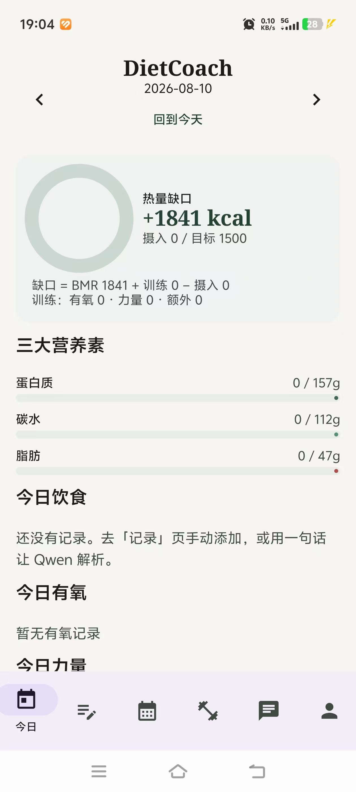
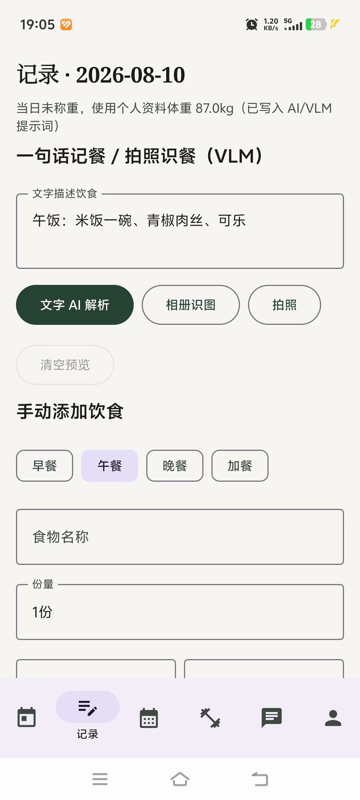
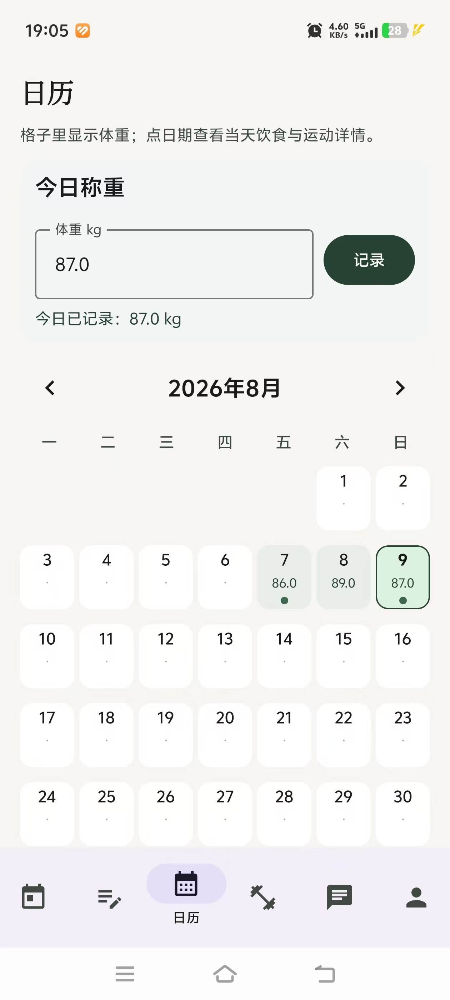
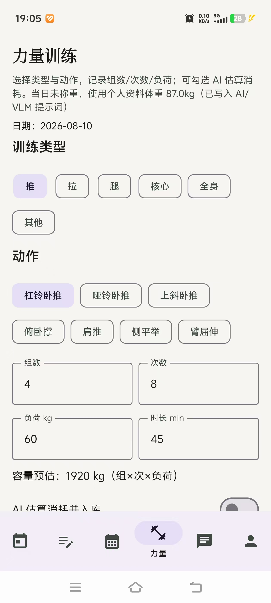
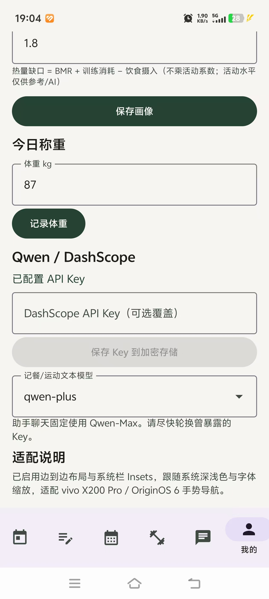

# DietCoach

面向 vivo X200 Pro / OriginOS 6 的饮食与训练记录 App（Kotlin + Jetpack Compose）。

本地优先统计三大营养素、有氧/力量消耗与热量缺口；通过阿里云 DashScope（Qwen）支持一句话记餐、拍照识餐、运动分析与 AI 助手。

## 功能

- **今日**：BMR 基底热量缺口、饮食 / 有氧 / 力量明细、体重趋势
- **记录**：手动记餐、AI 文本记餐、拍照 VLM 识餐、有氧记录与 AI 估消耗
- **日历**：月历体重与活动点，日详情坐标图
- **力量**：类型 / 动作 / 组次负荷 / 容量 / 热量，计入当日缺口
- **助手**：Qwen-Max 流式对话，LaTeX 公式渲染；说「帮我记录」可入库
- **我的**：画像、称重、API Key（加密存储）、指标说明

热量缺口公式：

```text
缺口 = BMR + 训练消耗（有氧 + 力量 + 额外）− 饮食摄入
```

（不乘活动系数；活动水平仅供参考 / AI）

## 使用示例

| 今日 | 记录 |
|:---:|:---:|
|  |  |

| 日历 | 力量 |
|:---:|:---:|
|  |  |

| 我的 |
|:---:|
|  |

- **今日**：查看 BMR 基底缺口、摄入进度与三大营养素；下方汇总当日饮食 / 有氧 / 力量。
- **记录**：文字描述交给 AI 解析入库，或相册 / 拍照识餐；也可手动添加饮食与有氧。
- **日历**：格子显示体重，有记录的日期带绿点；点日期进入当天详情。
- **力量**：选训练类型与动作，填写组数 / 次数 / 负荷（与可选时长），可 AI 估消耗并入库。
- **我的**：维护画像与今日称重，配置 DashScope API Key（加密存储）与记餐模型。

## 环境要求

- JDK 17
- Android SDK 35 + Build-Tools 35
- 真机开启 USB 调试后可用 `adb install`

## 配置 API Key（勿提交）

1. 在阿里云控制台创建 / 轮换 DashScope Key。
2. 复制 `local.properties.example` 为 `local.properties`：

```properties
sdk.dir=你的 Android SDK 路径
DASHSCOPE_API_KEY=你的Key
```

3. 也可在 App「我的」页写入 Key（`EncryptedSharedPreferences`）。

`local.properties` 已在 `.gitignore`，请勿提交真实 Key。

## 构建与安装

```powershell
$env:JAVA_HOME = "C:\path\to\jdk-17"
$env:ANDROID_HOME = "C:\path\to\android-sdk"
.\gradlew.bat :app:assembleDebug
.\gradlew.bat :app:testDebugUnitTest
adb install -r app\build\outputs\apk\debug\app-debug.apk
```

分享给他人的安装包请使用**不含** `DASHSCOPE_API_KEY` 的构建；对方在「我的」自行填写 Key。

微信传安装包请发 zip（微信常拦截直接打开 `.apk`）。

## 许可证

私人项目；未另行声明前请勿二次分发你的 API Key。
